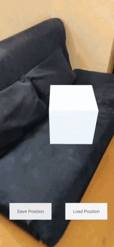
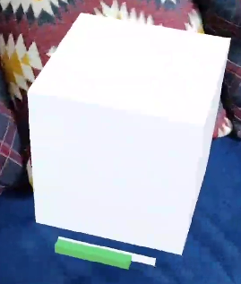

# Azure Spatial Anchor Helper

This service is intended to abstract the usage of azure spatial anchors (ASA) and provide an easy to use interface to store and persist world anchors for augmented reality (AR) applications when using the i5 Toolkit for mixed reality.

Please notice that in order to use this service the project needs be set up with Azure Spatial Anchors. A guide on how to install ASA can be found here: 

- [ASA Installation Guide](https://docs.microsoft.com/en-us/azure/spatial-anchors/how-tos/setup-unity-project?tabs=unity-package-web-ui)

## Functionalities

### Storing and Loading Anchors

An anchor is a location in the real world that is persitent in space and time. An anchor contains information about the position and rotation of an virtual object in the real world. This helper allows you to create an anchor so that a given game object in a unity AR application can be persitent in space over time. Storing the anchor creates an anchor based on detected features of the room and uploads the anchor to azure spatial anchors. This cloud service allows it to share anchors between sessions and even client on Android, iOS and HoloLens. The helper therefore also supports to download an anchor from ASA. All the session and access handling is done by the helper so that storing and loading is as easy as calling a function for each of those tasks.

### User Feedback while using ASA

Creating a anchor requiers a good understanding of the spacial structure of the real world. On some devices it can take some time to gain this understanding and it is often required to move the device arround to scan more perspectives of the room. Therefore the user needs to be guided by the application during this process. To give the user feedback it is neccassary to access information about the progress of the anchor creation. You can give the feedback helper an eventhandler that is called whenever the progress of the anchor creation changes.

One can create his own Feedback recievers by implementing the IASAFeedbackReciever interface. But there are also predefined Feedback recievers like the Progrssbar for example:

### Upcoming features

This is a list of features that are planned to be added in the future.

- Search for anchors via geolocation
- Search for anchors with andvanced critera queryies
- Prefabs for Userfeedback while scanning an environment
- Interface for connecting anchors
- Prefabs for Userguidance from one spatail anchor to another one

Your are welcome to add issues with feature requests.

## Prerequirements

Make sure that all the following libraries are installed:

- AR Foundation: [3.1.3](https://docs.unity3d.com/Packages/com.unity.xr.arfoundation@3.1/manual/index.html)
- Windows Mixed Reality (MRTK): [4.2.1](https://docs.unity3d.com/Packages/com.unity.xr.windowsmr.metro@4.2/manual/index.html)
- ARCore XR Plugin (for Android device support): [3.1.3](https://docs.unity3d.com/Packages/com.unity.xr.arcore@3.1/manual/index.html)
- ARKit XR Plugin (for iOS device support): [3.1.3](https://docs.unity3d.com/Packages/com.unity.xr.arkit@3.1/manual/index.html)
- Azure Spatial Anchors: [2.7.2](https://docs.microsoft.com/de-de/azure/spatial-anchors/how-tos/setup-unity-project)

In addition it is necessary that all Unity scenes that should use the helper has an AR Anchor Manager enabled.
You can add an AR Anchor Manger by following these steps:

- Make sure the scene has Mixed Reality Toolkit added to it.
    - If not use Mixed Reality Toolkit > Add To Scene and Configure... to add it. (This tab in the menu is only visible once MRTK is installed)
- Select the MixedRealityToolkit gameobject in the hirarchy.
- Add component AR Anchor Manager (Script).
- This will automatically add AR Session Origin as well.
- Do **not** select a camera in any of the added components.

## Usage

### Storing and Loading Anchors

Create an azure spatial anchors resource. You can follow [this guide](https://docs.microsoft.com/de-de/azure/spatial-anchors/quickstarts/get-started-unity-hololens?tabs=azure-portal#create-a-spatial-anchors-resource) for referance.

Then add the ASAHelper (Script) component to an gameobject in the scene. It is not neccessary to add it directly to the gameobject that should serve as an anchor later on.

Insert the **spatial anchors account id**, the **spatial anchors account key**, and the **spatial anchors account domain**. All these informations can be found in the azure portal after creating the ASA resource. Leave the **authentication mode** setting to the default value of **Api Key**.

You can now create and store the position of a gameobject in the real world by using the following function proved by the helper:

    using System;

    public ASAHelper myASAHelper;
    public Gameobject myGameObject;

    DateTimeOffset expOffset = DateTimeOffset.Now.AddDays(7);

    //this will create an acnhor with an expiration time of a week
    string anchorId = await myASAHelper.storeAnchor(myGameObject);

To load an anchor and position a gameobject as described by the anchor you use the following function of the helper:

    using System;

    public ASAHelper myASAHelper;
    public Gameobject myGameObject;
    //the anchor id is more likely recieved by using the storeAnchor() method of the ASAHelper
    public string anchorId;

    //this will load an anchor and position the gameobject according to the anchor
    string anchorId = await myASAHelper.storeAnchor(anchorId, myGameObject);

### Feedback while using ASA

The Feedback logic used for the ASA Feedback here is based on the observer pattern, so all the Feedback recievers can subscribe to be notified once the state of the asa service changes. The form of visualization depends on the implementation of the reciever. There exist predifined feedback visualizers that can be integrated directly to speed up the prototyping or development speed. But for production ready environments we recommend creating your own Feedback reciever as this gives you the most freedom regarding visualization.

#### Using predefined Feedback Visualizer

The general workflow of adding a predefined feedback visualizer is to add a prefab to your unity scene and then connect the ASAHelper (Script) the visualizer is intended to subscribe to in the unity inspector.

Here is a list of all the visualizers and the name of the prefab:

Name of Visualizer | Prefab Name               | Image of the Visualizer
------------------ | --------------------------| -----------------------
Progressbar        | Progressbar_ASA_Feedback  | 

#### Creating your own Feedback Visualizer

Coming soon...