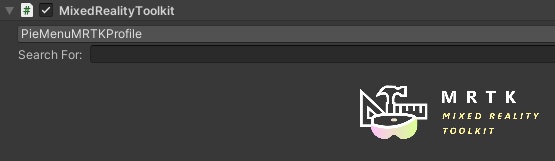
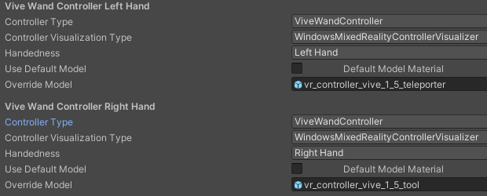
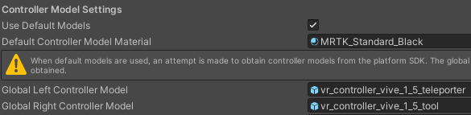
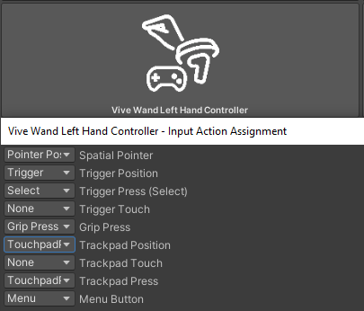
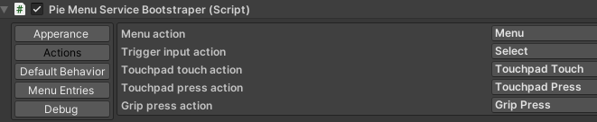

# Pie Menu

## Use Case

One challenge of Mixed Reality is the usage of User Interfaces.
Conventional 2D User Interfaces do not work due to a different set of input devices and true 3D interfaces are hard to implement and often bound to one specific use case.
A convenient compromise are 3D widgets, which allow the usage of interfaces similar to 2D interfaces in a 3D environment.

This Pie Menu is such a 3D Widget implementation. It is highly customizable and allows manipulation of the virtual world through the selection virtual tools.

## Usage
Under "i5 Toolkit for Mixed Reality/Runtime/PieMenu/Prefabs", there is the PieMenuManager prefab.
Drag it into the scene.
Once the manager and the scene is set up as described in the following sections, it spawns a 3D Pie Menu if the menu button is pressed or the menu gesture is performed.
In this menu, the user can select a virtual tool.
These virtual tools extend the input devices, by adding various event listeners and optic indicators what which button does to them.

The behavior and appearance of a tool can be configured by the developer in the inspector of the PieMenuManager. 
There the developer can easily set up handlers for the various events thrown by the tool, for example when the tool is selected, or when a button is pressed on the controller and setup things like an icon and description texts.
The icon is shown all the time on the input device and the description texts are displayed for an adjustable amount of time, after the tool was activated.

### Adjusting the MRTK Settings
Add the MRTK to the scene and then navigate to the inspector of the MRTK object.
Now you can either customize the MRTK profiles yourself or you can use the ones provided by the PieMenu.
They are located in "i5 Toolkit for Mixed Reality/Samples/PieMenu/"
To use them, you simply have to have to change the MRTK profile in the drop down in the inspector from the default to PieMenuMRTKProfile.

If you instead want to setup it yourself, you need to navigate to the input tab.
If you are using the default profiles, you always have to clone them, before you can edit anything.
Go to "Controller Visualization Settings" and add two controller definitions, one for the left and one for the right.
For controller type select the controller you want to setup, for example for the Vive Wands select Micosoft.MixedReality.Toolkit.OpenVR.Input.ViveWandController.
Note that the MRTK sometimes has troubles in identifying the controllers.
As long as you only support one controller type, you can also select the GenericOpenVRController as type, to work around this.
Assign the corresponding input source prefabs from "i5 Toolkit for Mixed Reality/Runtime/PieMenu/Prefabs" to the "Override Model" slot and deselect "Use Default Model".
For the Vive Wands that would be the vr\_controller\_vive\_1\_5\_teleporter and the vr\_controller\_vive\_1\_5\_tool prefab.

If you want to use the input simulation system for testing you also need to override the global models with these.

Now go to to "Input Actions" and add two new actions "TouchpadPress" and "TouchpadPosition". 
"TouchpadPress" has to be a digital action and "TouchpadPosition" a dual axis action.
Go to "Controllers" and assign these to the corresponding buttons.
For the Vive Wands, you have to assign them to "Trackpad Press" and "Trackpad Position".

In case you are using the generic controller workaround you have to edit the input action map for the generic controllers.
There you have to add two new interactions.
The first should be a dual axis interaction, operating on axis 17 and 18 for the left hand and on axis 19 and 20 for the right.
As action assign the "TouchpadPosition" action
The second interaction should be a digital one operating on joystick button 8 for th eleft and joystick button 9 for the right controller.
As action assign the "TouchpadPress" action.

### Binding Input Actions
In the inspector of the Pie Menu you see five tabs on the left.
Select the on named "Input Actions".
Assign the actions as showed in this Figure:

## Creating a Menu Entry
You can either follow these general instructions or start by building a small sample scene with the help of [these](./PieMenuStepByStep.md) step by step instructions.

Select the "Menu Entries" tab and then click on the button labeled "Add Entry".
This adds an entry to the Pie Menu, which you can now customize.
First, you have to choose an icon, which can be any Unity sprite, and then a name for the entry.
Now you can setup the event handlers to implement the actual functionality.
All input methods have the OnToolCreated, OnToolDestroyed, OnHoverOverTargetStart, OnHoverOverTargetActive and OnHoverOverTargetStop events.
The other events depend on the used input source, but are usually something like GripPressStarted and GripPressEnded.

The Pie Menu implementation already provides some useful event handlers, which are located in the GeneralToolAction script, which is already attached to the PieMenuManager.
To assign one of them to an event, press the small "+" button, drag the PieMenuManager in the object slot and select the corresponding method from the drop down.

Some of the general tool actions require an object transformer.
This is a component that takes the current target and decides if the current tool can operate on it and on which parts of it.
An object transformer needs to implement the IObjectTransformer interface and inherit MonoBehaviour.
To make an object transformer usable by the general tool actions, attach it to an object in the scene and then drag it into the object transformer slot of the general tool action component on the PieMenuManager.
An example of an object transformer can be seen in the step by step instructions.

You can use any method as event handler, as long as it it is in a script inheriting MonoBehaviour and as it has either no arguments or one of the type BaseInputEventData (located in the Microsoft.MixedReality.Toolkit.Input namespace).
For the hover events, you need to use the type FocusEventData instead.
The class ActionHelperFunction from the i5.Toolkit.MixedReality.PieMenu namespace provides some helpful methods for designing own event handler.

### General Tool Actions

The event handler already provided by the Pie Menu aim at providing visual feedback to the user.

- SpawnCurrentIconOverObject: This method can be used to signal the user with which objects his current tool can interact. When the provided objectTransformer accepts the currently focused target, the icon from the current tool is spawned over the collider of the object. This needs to be set as handler for the OnHoverOverTargetStart event.
- UpdateCurrentIconOverVisualisation: This method needs to be set as handler for the OnHoverOverTargetActive event, in order to make the icon over object functionality work.
- DestroyCurrentIconOverVisualisation: This method needs to be set as handler for the OnHoverOverTargetStop event, in order to make the icon over object functionality work.
- ActivateDesciptionTexts: This method activates the description texts again. For the Vive Wands it is recommended to assign this handler to the OnInputActionStartedGrip event.
- DeactivateDesciptionTexts: Deactivates the description texts again. For the Vive Wands it is recommended to assign this handler to the OnInputActionEndedGrip event.

### The Default Entry
In the "Default Behavior" tab, the behavior for the case when no handler for a thrown event in the currently selected tool is specified can be adjusted. This is handy for defining handlers that should be used by every tool and saves the work of manually adding them to them. This can for example be used to use the Activate-/DeactivateDesciptionTexts for every tool, since giving the user a way to look up what which button does is always a good idea.

### Un- and Redoable Actions
In order to make tool actions easily un- and redoable, the Pie Menu already offers an implementation of the Command Pattern.
To use it, your tool actions need to implement the IToolAction interface.
To do that, they need to implement the `DoAction()` and `UndoAction()` function, and implement the actual action into the do function and an action that reverses the effect into undo. 
Now instead of assigning the do action as an event handler, you need to also implement a wrapper with a function that first setups the action and then calls the already provided command stack service with
`ServiceManager.GetService<CommandStackService>()` and then call `AddAndPerformAction(action)` from it. This function can then be assigned as eventhandler.
The service manager is provided by the i5 toolkit and is in the namespace i5.Toolkit.Core.ServiceCore .
Remember that the wrapper needs to inherit MonoBehavior in order to make its functions assignable as event handler in the PieMenuManager.

To now un- and redo these actions, you need to call the Un- and RedoAction from the already provided Undoactions script.
You can for example assign these to the left and right click on the touchpad of a Vive Wand.
