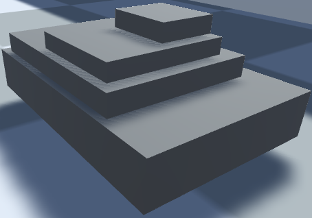
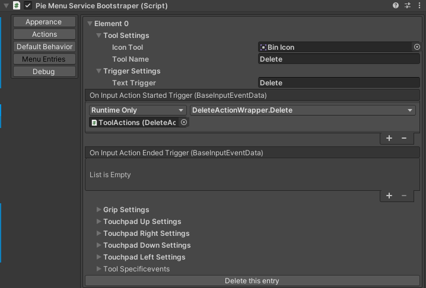
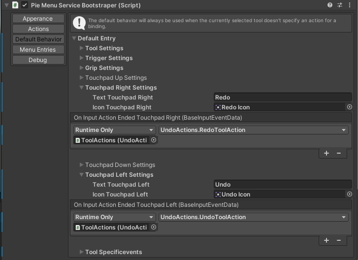
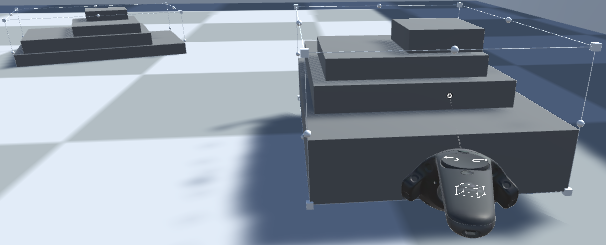
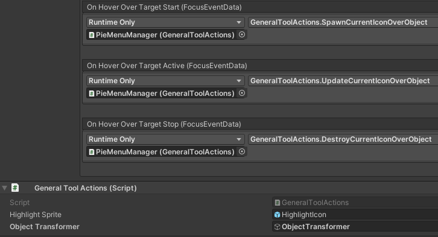
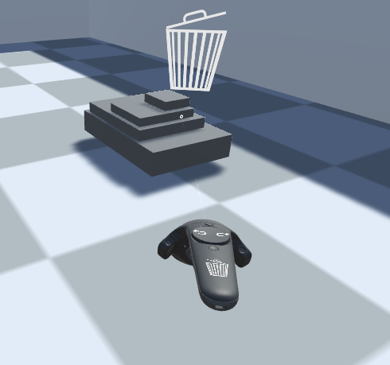

# Building a Small Sample Scene
This section describes how to build a sample scene with a Pie Menu that offers a delete, resize and move, and color change tool.
Every action will be un- and redoable. The resulting scene of this can also be seen in "i5 Toolkit for Mixed Reality/Samples/PieMenu"	

## General Setup
Perform the general setup as described in the Usage Section.
Now create a script called ManipulationInformation with three public bools: deletePossible, manipulationPossible and colorChangePossible.
Add some empty objects to the scene, attach the ManipulationInformation component you created earlier to them and give them some 3D child objects, that form a slightly more complex object.
These child objects should not have the ManipulationInformation component attached.
They should look somewhat like this for example:

<center>

</center>

They need to have colliders to make them selectable with MRTK input devices, but as long as you used the default 3D objects, that will be the case.
Set the deletePossible flag for some objects of your choice. 

Also create some basic scenery like a floor and some walls, without the ManipulationInformation component attached.
These will be important later to see if your tools operate on the correct objects and are for example not able to delete the floor.

## Delete Tool
The delete tool should be able to delete all objects with the ManipulationInformation component attached and the deletePossible flag set (and only these), properly communicate to the user what can be deleted and its actions should be un- and redoable.

### Functionality
First, create a class called DelteAction, that implements the IToolAction interface.
As only field it has a GameObject called target.
The do action should delete it and the undo action should restore it again.
In a proper project, a good way to do this would be to first serialize the GameObject before destroying it, so it can be deserialized and instantiated in the undo action again.
However, for the sake of simplicity our delete action will simply activate and deactivate the target.
For a user this looks like the object was actually deleted.
The class then looks like this:

```csharp
using UnityEngine;
using i5.Toolkit.MixedReality.PieMenu;

public class DeleteAction : IToolAction
{
    GameObject target;

    public DeleteAction(GameObject target)
    {
        this.target = target;
    }

    void IToolAction.DoAction()
    {
        target.SetActive(false);
    }

    void IToolAction.UndoAction()
    {
        target.SetActive(true);
    }
}
```
Now you need to create the wrapper, that acts as event handler.
It needs a delete function with a BaseInputEventData as argument that reads out the currently focused object, checks if it is deletable, at which part in the hierarchy the deleting should start and if it then can be deleted, preforms the delete action through the command stack manager.

First, the delete methods needs to to get the currently focused object.
For that, you can use the `GetTargetFromInputSource()` function from the ActionHelperFunctions class.

Now, it needs to check if the object is actually deltable and which part of it should be deleted, which is an important question for object that have child or parent objects attached, because the user can focus one of the child objects, but we don't want to delete only the child, but the entire object.
The deletability shouldn't be checked directly in the delete function, but with the help of an ObjectTransformer.
This is because it doesn't only need to get checked here, but also in the event handler of the tools focus events, that will signal the user if an object is deletable.
The signaling will be done later through the already provided SpawnCurrentIconOverObject functionalities.

Create a script ObjectTransformer that implements the IObjectTransformer interface.
Now you need to implement the transformObject method from the interface, which takes a GameObject that should be checked for deletability and at which part the delete process should start, and the name of the current tool, so different tools can effect different objects.
First, the method needs to get the object from the hierarchy to which the ManipulationInformation component is attached to, in case it even exists.
To do this, use the `GetGameobjectOfTypeFromHirachy()` function from the ActionHelperFunctions.
This method iterates upwards in the hirachy of the provided GameObject and returns the first GameObject that has a script of the provided type typeToSearch attached.

If `GetGameobjectOfTypeFromHirachy()` returned something, the transform method now needs to get the ManipulationInformation from it.
Now, if the the provided name of the current tool is "Delete", it needs to check if the deletePossible flag is set and if that is the case, return the GameObject, that has the ManipulationInformation component attached.

To make it possible to provide the object transformer to the already provided functionalities, it also needs to inherit the MonoBeahviour class. The ObjectTransformer now should look like this:

```csharp
using UnityEngine;
using i5.Toolkit.MixedReality.PieMenu;

public class ObjectTransformer : MonoBehaviour, IObjectTransformer
{
    GameObject IObjectTransformer.transformObject(GameObject objectToTransform, string toolName)
    {
        GameObject transformed = ActionHelperFunctions.GetGameobjectOfTypeFromHirachy(objectToTransform,
                                                                                      typeof(ManipulationInformation));
        if (transformed != null)
        {
            ManipulationInformation information = transformed.GetComponent<ManipulationInformation>();
            switch (toolName)
            {
                case "Delete":
                    if (information.deletePossible)
                    {
                        return transformed;
                    }
                    break;
            }
        }
        return null;
    }
}
```

Create an empty GameObject in the scene, and attach the ObjectTransformer component to it.

Now we can continue with the delete action wrapper.
It needs to retrieve the ObjectTransformer from the scene and then use the transform method from it on the target.
If this results in a valid GameObject, it now needs to create a new DeleteAction with it as target and tell the the CommandStackManager to execute the action.
The CommandStackManager is already provided as a Service and initialized by the PieMenuManager.
It can be accessed through the ServiceManager class with `ServiceManager.GetService<CommandStackService>()`
The delete action wrapper should now look like this:

```csharp
using UnityEngine;
using Microsoft.MixedReality.Toolkit.Input;
using i5.Toolkit.MixedReality.PieMenu;
using i5.Toolkit.Core.ServiceCore;

public class DeleteActionWrapper : MonoBehaviour
{
    public void Delete(BaseInputEventData data)
    {
        GameObject target = ActionHelperFunctions.GetTargetFromInputSource(data.InputSource);
        IObjectTransformer objectTransformer = FindObjectOfType<ObjectTransformer>().GetComponent<ObjectTransformer>();
        target = objectTransformer.transformObject(target, "Delete");

        if (target != null)
        {
            DeleteAction deleteAction = new DeleteAction(target);
            ServiceManager.GetService<CommandStackService>().AddAndPerformAction(deleteAction);
        }
    }
}
```

### Creating a Menu Entry for the Delete Tool

To now use the delete functionality through the Pie Menu, you need to create a new menu entry.
Go to the PieMenuManager in your scene, go to the menu entries tab and then add a new menu entry. 
Extend the tool settings, name the tool "Delete" and then assign it an icon.
Some icons are already provided, for example a bin icon, which you can use here.

To use the delete action wrapper you created, you need to attach it to an GameObject.
Create an empty GameObject in the scene, name it ToolActions and attach the DeleteActionWrapper component to it .

Now go to the trigger settings in the menu entry for the delete tool.
There, change the description text to "Delte".
Finally, click the small "plus" icon on the bottom right of the "On Input Action Started Trigger" event, drag the ToolActions object in the field saying "None (Object)" and then select the delete action wrapper from it.
This should now look like this:



When you now start the scene you created, you should be able to open the menu by pressing and holding the menu button and then to select the entry with the bin icon.
The bin icon should then be displayed on the input source and the trigger should be labeled with "Delete" for three seconds after selecting the tool.
Pressing the trigger while pointing at an object with the ManipulationInformation component attached and the deletePossible flag set should now result in its "deletion" (actually its deactivation).

Now, the do and undo functionality is still missing.
Attach the provided UndoActions component to the ToolActions object.
In order to make the un- and redo functionality accessible to all tools, you don't need to add it to every tool individually but instead you can add it to the default entry, that is explained in more detail in the The Default Entry Section.
To do that, go to the PieMenuManager and select the default behavior tab.
There, you can add the Undo and Redo Toolaction to the events you want.
For the ViveWands for example, you can bind them to the left and right clicks on the touch pad.
Remember to assign a name and an icon.
You can use the un- and redo icons that are already provided.



## The Move and Resize Tool

For moving and resizing we will use the BoundsControl and ObjectManipulator components from the MRTK.
Add theses to the parent object of the objects you want to be able to move and resize, but disable them.
Also remember to set the manipulationPossible flag.

These components should now be enabled as soon as the manipulation tool is selected and disabled, when it is deselected again.
To accomplish that, we can use the OnToolCreated and OnToolDestroyed events, but first we need an event handler.
Create a script called ManipulationActionWrapper (the actual ManipulationAction will be created later).
Now create a method called StartManipulating() in this script.
It needs to find all objects in the scene that have an ManipulationInformation component attached, the manipulationPossible flag set and then it needs to enable there BoundsControl and ObjectManipulator components.
The objects on which the components were enabled also need to be stored, so the components can be disabled again later.
Now create a method called StopManipulating, that disables them again.
It should now look like this:

```csharp
using UnityEngine;
using Microsoft.MixedReality.Toolkit.Input;
using i5.Toolkit.MixedReality.PieMenu;
using Microsoft.MixedReality.Toolkit.UI.BoundsControl;
using Microsoft.MixedReality.Toolkit.UI;

ManipulationInformation[] objectsThatCanBeManipulated;

public class ManipulationActionWrapper : MonoBehaviour
{
    public void StartManipulating()
    {
        objectsThatCanBeManipulated = FindObjectsOfType<ManipulationInformation>();
        foreach (var objectToManipulate in objectsThatCanBeManipulated)
        {
            if (objectToManipulate.manipulationPossible)
            {
                objectToManipulate.gameObject.GetComponentInChildren<BoundsControl>().enabled = true;
                objectToManipulate.gameObject.GetComponentInChildren<ObjectManipulator>().enabled = true;
            }
        }
    }
    
    
    public void StopManipulating()
    {
        foreach (var objectToManipulate in objectsThatCanBeManipulated)
        {
            if (objectToManipulate != null && objectToManipulate.manipulationPossible)
            {
                objectToManipulate.gameObject.GetComponentInChildren<BoundsControl>().enabled = false;
                objectToManipulate.gameObject.GetComponentInChildren<ObjectManipulator>().enabled = false;
            }
        }
    }
}
```

To now use these functions, add the ManipulationActionWrapper to the ToolActions object and create a new menu entry just like for the delete tool.
Call the new entry "Manipulation" and give it an icon, like the BoundingBoxIcon for example.
Now extend the Tool Specific Events menu point and assign StartManipulating() to the OnToolCreated event and StopManipulating() to the OnToolDestroyed event.

When you now start the scene and select the manipulation tool, all GameObjects that were set up as described earlier should be surrounded by a bounding box, with manipulation handles at each side for rotation and scalation. 
Translation should be possible through simply clicking and holding somewhere on the bounding box, where there is no manipulation handle.



But now we face a problem: the manipulation actions should be reversable but they are performed by a different library and can therefore not easily be transformed into commands form the command stack pattern.
For this situation the command stack implementation offers the functionality to add a command to the stack without executing it.
This allows us to let the first execution be handled by different library and then to add a simplified version of it to the stack.
In our case, the MRTK provides very convenient manipulation options with nice smoothing and a lot of visual indicators.
But for reversing these actions, it is completely sufficient to simply set the position, rotation and scalation of the manipulated object back its original values.

Create the ManipulationAction class, which again implements the IToolAction interface and has a attribute for the target and start/end position, rotation and scalation.
The DoAction sets the targets transform values to the end values and the UndoAction to the start values.

```csharp
using UnityEngine;
using i5.Toolkit.MixedReality.PieMenu;

public class ManiplulationAction : IToolAction
{
    public GameObject target;

    public Vector3 startPosition;
    public Quaternion startRotation;
    public Vector3 startScalation;

    public Vector3 endPosition;
    public Quaternion endRotation;
    public Vector3 endScalation;

    void IToolAction.DoAction()
    {
        target.transform.SetPositionAndRotation(endPosition, endRotation);
        target.transform.localScale = endScalation;
    }

    void IToolAction.UndoAction()
    {
        target.transform.SetPositionAndRotation(startPosition, startRotation);
        target.transform.localScale = startScalation;
    }
}
```


Now create the methods `StartPositionRecording()` and `EndPositionRecording()` in the ManipulationActionWrapper class. `StartPositionRecording()` creates a new ManipulationAction and sets its start values to the current transform values of the target and `EndPositionRecording()` sets the end values to the current transform values and adds it on the stack, but without executing it.

```csharp

using UnityEngine;
using Microsoft.MixedReality.Toolkit.Input;
using i5.Toolkit.MixedReality.PieMenu;
using i5.Toolkit.Core.ServiceCore;
using Microsoft.MixedReality.Toolkit.UI.BoundsControl;
using Microsoft.MixedReality.Toolkit.UI;

public class ManipulationActionWrapper : MonoBehaviour
{

    ManiplulationAction curentManiplulationAction;

    public void StartPositionRecording(BaseInputEventData data)
    {
        GameObject target = ActionHelperFunctions.GetTargetFromInputSource(data.InputSource);

        IObjectTransformer objectTransformer = FindObjectOfType<ObjectTransformer>().GetComponent<ObjectTransformer>();
        target = objectTransformer.transformObject(target, "Manipulate");
        if (target != null)
        {
            curentManiplulationAction = new ManiplulationAction();
            curentManiplulationAction.target = target;
            curentManiplulationAction.startPosition = target.transform.localPosition;
            curentManiplulationAction.startRotation = target.transform.localRotation;
            curentManiplulationAction.startScalation = target.transform.localScale;
        }
    }


    public void EndPositionRecording(BaseInputEventData data)
    {
        GameObject target = ActionHelperFunctions.GetTargetFromInputSource(data.InputSource);

        IObjectTransformer objectTransformer = FindObjectOfType<ObjectTransformer>().GetComponent<ObjectTransformer>();
        target = objectTransformer.transformObject(target, "Manipulate");
        if (target != null && target == curentManiplulationAction.target)
        {
            curentManiplulationAction.endPosition = target.transform.localPosition;
            curentManiplulationAction.endRotation = target.transform.localRotation;
            curentManiplulationAction.endScalation = target.transform.localScale;
            ServiceManager.GetService<CommandStackService>().AddAction(curentManiplulationAction);
        }
    }

	[...]
}

```


Finally, assign these two methods to the OnInputActionStartedTrigger and OnInputActionEndedTrigger event of the manipulation tool respectively.

## The Color Change Tool
The color change tool is very similar to the previous functionalities and shouldn't pose a problem to you.
Create an undoable tool that can apply colors from a color array to the object the tool is pointing at!
Pressing up on the touch pad should increase the index of the color array and apply it and down should decrease and apply.
Note, that you can access the color of a GameObject with `gameObject.GetComponent<Renderer>().material.color`

## Signaling
Now we want to signal to the user that his currently selected tool can affect the object he is currently pointing at.
To do that, we can use the already provided CurrentIconOverObject functions.
Go to the default behavior tab and open the Tool Specific Events menu point.
There, assign the SpawnCurrentIconOverObject function to the hover start, the UpdateCurrentIconOverObject the the hover active and the DestroyCurrentIconOverObject to the hover end event.
These function are all located in the general tool actions script, which is already attached to the PieMenuManager.

Now the CurrentIconOverObject functions needs to know which object transformer we are using.
Drag the object transformer object into the corresponding slot in the general tool actions component of the PieMenuManager.



When you now hover over an object with a tool that can affect it, the icon of the tool should be displayed over the object.



We also want to give the user an option to check what certain buttons do, after the explanation texts faded.
Assign the ActivateDescriptionTexts and DeactivateDescriptionTexts functions from the general tool actions to the OnInputStartedGrip and OnInputEndedGrip events.